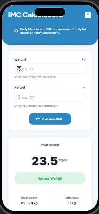
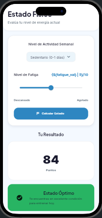
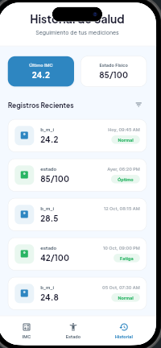

# Health Mini Tracker

Aplicación móvil desarrollada en Flutter como proyecto individual para la materia de Desarrollo de Aplicaciones Móviles.

Regina González Pérez
Taller de Apps/Individual 
Mayo 2026

---

## Descripción

Health Mini Tracker es una aplicación de salud personal que permite al usuario calcular su Índice de Masa Corporal (IMC), evaluar su estado físico mediante un índice de bienestar, y consultar un historial de los resultados obtenidos durante la sesión.

---

## Funcionalidades

### Calculadora de IMC
- Ingreso de peso en kilogramos y altura en metros
- Cálculo automático del Índice de Masa Corporal
- Clasificación del resultado en tres categorías: Bajo peso, Normal, Sobrepeso
- Almacenamiento del resultado en el historial de sesión

### Índice de Estado Físico
- Selección del nivel de actividad física: Baja, Media o Alta
- Ingreso del nivel de cansancio o dolor mediante un control deslizante (0 a 10)
- Cálculo de un índice de bienestar en escala de 0 a 100
- Clasificación del estado: Óptimo, Normal o Fatiga

### Historial
- Registro en memoria de todos los cálculos realizados durante la sesión
- Visualización de tipo de cálculo, valor obtenido, categoría y fecha/hora
- Opción para limpiar el historial

---

## Diseño de pantallas

El diseño de la interfaz fue prototipado en FlutterFlow antes de su implementación en Flutter.

| Calculadora IMC | Estado Físico | Historial |
|---|---|---|
|  |  |  |

---

## Lógica de cálculo

**IMC**
IMC = peso (kg) / (altura en metros)²
Menor a 18.5          → Bajo peso
Entre 18.5 y 24.9     → Normal
Mayor o igual a 25    → Sobrepeso

**Índice de Estado Físico**
base = 100
Actividad baja   → base - 10
Actividad media  → base sin cambio
Actividad alta   → base + 10
Cansancio/dolor  → base - (nivel x 5)
Resultado final  → limitado entre 0 y 100
Mayor o igual a 75  → Óptimo
Entre 50 y 74       → Normal
Menor a 50          → Fatiga

---

## Arquitectura del proyecto
lib/
├── main.dart
├── models/
│   └── health_record.dart
├── screens/
│   ├── imc_screen.dart
│   ├── estado_fisico_screen.dart
│   └── historial_screen.dart
└── utils/
└── health_logic.dart


## Proceso de desarrollo

1. Prototipado de las tres pantallas en FlutterFlow
2. Creacion del proyecto Flutter con estructura por capas
3. Implementacion de la logica de calculo en archivo independiente
4. Desarrollo de la interfaz de usuario por pantalla
5. Integracion del historial compartido entre pantallas
6. Pruebas en navegador y dispositivo fisico

---

## Instrucciones para ejecutar

**Requisitos previos**
- Flutter SDK 3.x instalado
- Visual Studio Code o Android Studio
- Emulador Android o dispositivo fisico conectado

**Pasos**

```bash
git clone https://github.com/regisgonper/Salud-tracker.git
cd Salud-tracker
flutter pub get
flutter run
```

---

## Repositorio

https://github.com/regisgonper/Salud-tracker
